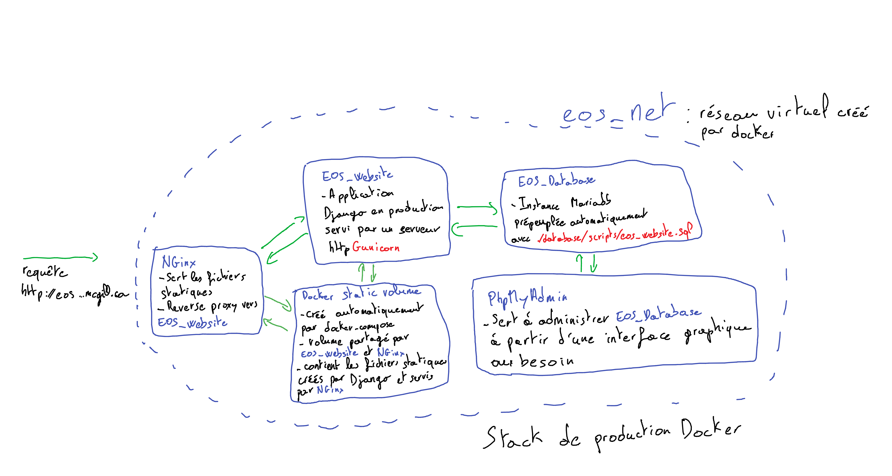

#EOS Website

## Requis
* Docker 
* docker-compose
* make
* fichier .env qui contient tous les identifiants nécessaires pour faire fonctionner le stack. Non inclus dans le repo github pour des raisons de sécurité

## Configuration un environnement de développement local

* Créer un environnement virtuel <code>python3 -m venv ENV</code>
* <code>pip install --upgrade pip && pip install -r requirements/development.pip</code>

> Des librairies externes peuvent manquer pour installer correctement toutes dépendances. Les installer et recommencer <code>pip install -r requirements/development.pip</code>
Par exemple pour une installation fraîche d'Ubuntu 18.04 LTS, 
<code>sudo apt-get install libmariadbclient-dev python3-venv python3-dev</code>

## Serveur de développement et de production, base de données et phpmyadmin
Ci-dessous un schéma présentant les différentes entités du stack en production:

**IMPORTANT: s'assurer que le fichier .env soit à la racine du projet, sinon le serveur ne démarrera pas**
### Démarrer et arrêter le stack
Depuis la racine du projet:

* Démarrer le stack de développement:  <code>sudo make dev</code>
* Arrêter le stack de développement: <code>sudo make stop-dev</code>
* Démarrer le stack de production:  <code>sudo make prod</code>
* Arrêter le stack de production: <code>sudo make stop-prod</code>

Sur le *stack DEV*, le site est accessible à *http://localhost:8000* et l'interface d'administration de la BD à *http://localhost:8001*
Sur le *stack PROD*, le site est accessible à *http://172.29.29.2* et l'interface d'administration de la BD à *http://172.29.29.3*
Pour administrer la base de données et se connecter sur le WebGUI de phpmyadmin, les identifiants sont les mêmes que pour le compte de la BD (voir .env)
D'autres commandes sont disponibles pour afficher les logs, supprimer les images des containers etc. Voir le makefile.

**IMPORTANT: La base de données est peuplée automatiquement lorsque que la base de données est instanciée à partir du fichier sql ./database/sql_scripts/eos_website.sql**

## Faire des modifications 
### Ajouter une nouvelle station dans l'onglet *Instrumentation*

**Lancer le stack de développement (à partir de ROOT_DIR) et aller sur https://localhost:8000**. À chaque changement dans les fichiers (css, html etc), il suffit de recharger la page du navigateur (**CTRL + R**) pour voir les changements à l'écran.

**Se placer dans ./apps/instrumentation**

#### 1. Le fichier HTML
##### Création

Ajouter le nouveau fichier html de la nouvelle page (sentinelX.html) dans */templates/instrumentation/*. Ça peut être de simplement créer une copie de */templates/instrumentation/sentinel_template.html*. Ajouter les fichiers css et les scripts au besoin. **JQuery et bootstrap sont déjà inclus dans les templates de base ROOT_DIR/templates/layouts/**

##### Ajouter du contenu se trouvant dans ROOT_DIR/media
Les fichiers ressources (données des stations, image, pdf etc) sont accessibles directement dans le code HTML par **{{ MEDIA_URL }}** qui se traduit actuellement par **/media/**.

exemple: ``

#### 2. La vue 
**Dans /instrumentation/views.py**, dupliquer le template d'une view et modifier le titre qui sera affiché dans l'onglet de la page.

#### 3. Le routage
**Dans /instrumentation/urls.py**, ajouter l'url qui va être associée à la vue qui vient d'être créée. Le début de l'url est déjà préconstruit (nomdedomaine/instrumentation/...). C'est juste le bout de l'url qui va être ajouté ici. Le paramètre *name* est très important car il va permettre d'invoquer directement l'url dans la barre de navigation du site.

exemple: ` path('sentinelXYZ', views.SentinelXYZView.as_view(), name='sentinelXYZ_instrumentation'),` va associer l'url *nomdedomaine/instrumentation/sentinelXYZ* à la vue *SentinelXYZVIew* se trouvant dans **./instrumentation/views.py** et sera directement appelable dans un hyperlien `<a>` avec le nom *sentinelXYZ_instrumentation*.

#### 4. La navigation
**Dans ROOT_DIR/templates/components/navigation.html**, ajouter dans le dropdown (ligne 22 présentement) *Instrumentation* un hyperlien vers la nouvelle page créée à partir du nom d'URL défini précédement.

exemple: `<a class="dropdown-item" href=>Sentinel XYZ</a>` 

### Gestion des stations dans l'onglet *stations*
Tout se passe dans le fichier **/database/sql_scripts/eos_website.sql**

Ligne 44 il y a une commande *INSERT INTO* qui ajoute les stations avec, dans l'ordre, leur nom, le nom de leur dossier dédié dans **/media/data/** et les différentes sous-pages à leur associer. Ces sous-pages (meteograms, radar, disdrometer, ceilometer) sont activables ou désactivables par des booléens. 

ie: 1 1 1 1 signifie que l'ensemble *meteograms, radar, disdrometer, ceilometer* est associé à la station.

ie: 1 0 1 0 signifie que l'ensemble *meteograms, disdrometer* est associé à la station.

Pour appliquer les changements si le stack est déjà lancé, simplement utiliser une de ces deux commandes:

<code>sudo make rebuild-db-dev</code>
<code>sudo make rebuild-db-prod</code>

Ces commandes exécutent la séquence:
1. Arrêter le container de la base de données
2. Supprimer le container
3. Reconstruire le container à partir des informations du docker-compose.yml
4. Redémarrer le container du site web pour qu'il se reconnecte à la nouvelle base de données et recrée les tables administratives de Django

----------------------------------
1. Vérifie que t'es sur la branche develop git branch 
2. Récupère les dernier changements de origin develop git pull
3. Fais tes modifs
4. Quand t'as fini et que tout marche aussi sur le stack prod ajoute tes derniers changements dans le prochain commit git add . à partir de la racine du projet ou git add :/ de n'importe quel sous dossier, emplacement dans le répertoire git
5. Crée ton commit git commit -m"tonmessagelolol"
6. Pousse ton commit sur le répertoire distant git push
Maintenant tu veux mettre ces changements sur master pour des raisons de bonnes pratiques :p
7. Place toi sur la branche master git checkout master
8. Récupère les derniers changements de origin master git pull
9. Récupère les changements sur develop que tu veux merger sur master git pull origin develop
10. Pousse ton nouveau merge sur origin master git push
ouvre une session ssh sur mesonet
11. Vérifie que t'es sur la branche master git branch 
12. Récupère les dernier changements de origin master git pull
13. Mets à jour le stack prod make prod
